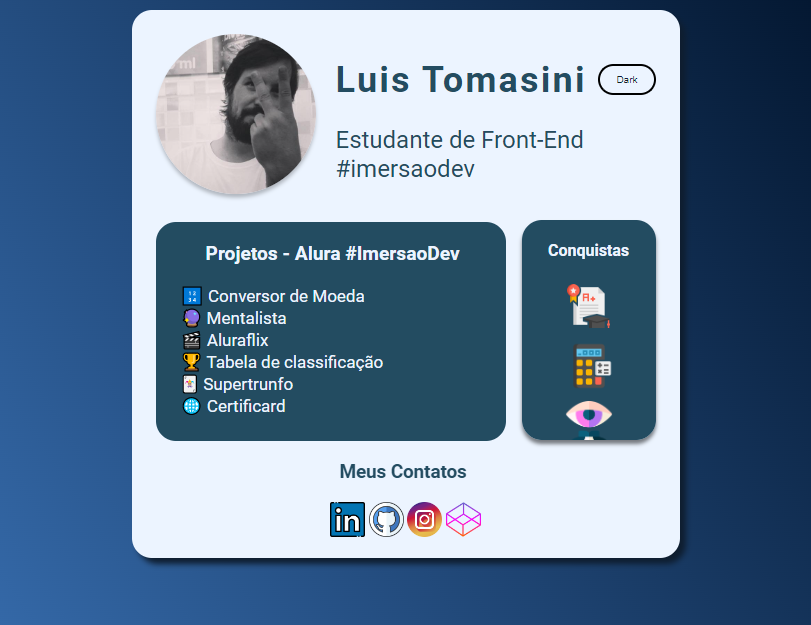

# Imersão Dev - Alura

Olá! Este é o portfólio dos projetos finalizados na semana de imersão utilizando o CodePen.

# Certificard

## Além das pastas do repositório, acesse os projetos no meu perfil do CodePen!

🔗 [Clique aqui para acessar](https://luistomasini.github.io/alura-imersaodev/aula10/)

## O que aprendi

- JS
  - Variáveis, operações
  - Arrays
  - Objetos
  - Funções
  - Tabelas
  - `for` `while` `for in`

- HTML e CSS
  - Estrutura do HTML e tags mais importantes
  - Conceitos gerais de CSS: Seletores, propriedades e valores
  - Figma

